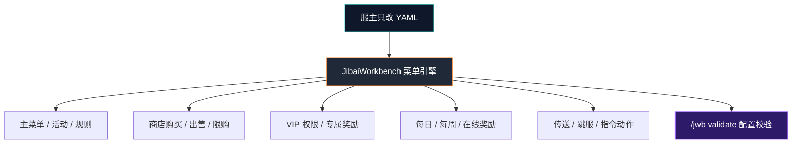

<div align="center">

# JibaiWorkbench

### 即白服务器交互工作台

<strong>把 Minecraft 服务器菜单、商店、VIP、奖励、传送和活动入口，全部变成可配置的 YAML 工作流。</strong>

<br>


<br><br>

<a href="WIKI.md"><strong>查看完整 WIKI</strong></a>
 ·
<a href="#5-分钟启动">5 分钟启动</a>
 ·
<a href="#功能矩阵">功能矩阵</a>
 ·
<a href="#配置示例">配置示例</a>
 ·
<a href="#指令中枢">指令中枢</a>

</div>

---

> [!IMPORTANT]
> JibaiWorkbench 面向服主设计。全程只改 YAML、执行指令，不需要写 Java 代码。菜单文件位于 `plugins/JibaiWorkbench/menus/`，一个菜单一个 `.yml`，改完执行 `/jwb reload` 即可生效。

## 项目定位

JibaiWorkbench 是一套基于箱子 GUI 的服务器交互系统。它把服主常用的服务器入口做成可组合模块：主菜单、商店、VIP、奖励、新手指南、传送、规则、活动页，都可以通过模板快速生成，再用 YAML 修改按钮、动作、条件和展示文本。



## 5 分钟启动

> [!TIP]
> 第一次启动会自动生成 8 套默认菜单。先跑起来，再慢慢改样式和按钮，比从零写配置快很多。

| Step | 操作 | 结果 |
|---:|---|---|
| 01 | 把 `JibaiWorkbench-1.0.0.jar` 放进 `plugins/` | 插件准备加载 |
| 02 | 重启服务器 | 生成默认配置和菜单模板 |
| 03 | 游戏内执行 `/jwb open main` | 打开主菜单 |
| 04 | 编辑 `plugins/JibaiWorkbench/menus/main.yml` | 修改标题、按钮、动作 |
| 05 | 执行 `/jwb reload` | 热重载菜单 |
| 06 | 执行 `/jwb validate` | 检查 YAML、slot、Material、依赖状态 |

```yaml
title: "&b&l我的服务器 &8» &f主菜单"
```

> [!WARNING]
> 所有 YAML 必须使用 UTF-8 保存，否则中文可能乱码。推荐 VS Code / Notepad++，不要用 Windows 记事本另存为 ANSI。

## 功能矩阵

| 模块 | 已内置能力 | 适合场景 |
|---|---|---|
| GUI 菜单 | 标题、行数、背景、按钮、发光、CustomModelData、多槽位按钮 | 主菜单、规则页、活动入口 |
| 动作系统 | `open`、`close`、`back`、指令、消息、标题、音效、传送、跳服、冷却 | 点击按钮触发一串操作 |
| 商店系统 | 购买、出售、限购、库存、冷却、确认页、失败退款 | 金币商店、礼包购买、VIP 商品 |
| 奖励系统 | 每日、每周、一次性、在线时长奖励 | 签到、在线奖励、VIP 每日礼包 |
| 条件系统 | 权限、金币、冷却、奖励状态 | VIP 可见按钮、金币不足禁止点击 |
| 变量系统 | `{player}`、`{world}`、`{balance}`、`{group}`、PAPI 变量 | 动态显示玩家信息 |
| 校验系统 | rows、slot、Material、价格、目标菜单、依赖检查 | 配置上线前排错 |

## 内置模板

<table>
  <tr>
    <th>模板</th>
    <th>创建命令</th>
    <th>用途</th>
  </tr>
  <tr>
    <td><code>main</code></td>
    <td><code>/jwb create main main</code></td>
    <td>服务器主菜单与导航入口</td>
  </tr>
  <tr>
    <td><code>shop</code></td>
    <td><code>/jwb create shop myshop</code></td>
    <td>购买、出售、限购、库存商店</td>
  </tr>
  <tr>
    <td><code>vip</code></td>
    <td><code>/jwb create vip vip</code></td>
    <td>按权限显示的 VIP 菜单</td>
  </tr>
  <tr>
    <td><code>reward</code></td>
    <td><code>/jwb create reward reward</code></td>
    <td>每日、每周、在线时长奖励</td>
  </tr>
  <tr>
    <td><code>activity</code></td>
    <td><code>/jwb create activity activity</code></td>
    <td>活动入口、限时玩法入口</td>
  </tr>
  <tr>
    <td><code>guide</code></td>
    <td><code>/jwb create guide guide</code></td>
    <td>新手指南</td>
  </tr>
  <tr>
    <td><code>teleport</code></td>
    <td><code>/jwb create teleport teleport</code></td>
    <td>世界、主城、资源区传送</td>
  </tr>
  <tr>
    <td><code>rules</code></td>
    <td><code>/jwb create rules rules</code></td>
    <td>服务器规则展示</td>
  </tr>
</table>

## 配置示例

<details open>
<summary><strong>商店按钮：购买、出售、限购、库存全部交给插件处理</strong></summary>

商品按钮的关键是 `shop:` 段落。插件会自动处理扣款、发货、限购、库存。不要再手写 `take-money`，否则容易出现扣款成功但发货失败的问题。

```yaml
buttons:
  diamond:
    slot: 10
    material: DIAMOND
    name: "&b钻石 x8"
    lore:
      - "&7购买价：&a100 金币"
      - "&7出售价：&e60 金币"
      - ""
      - "&e左键购买 &7/ &e右键出售"
    shop:
      buy-price: 100.0
      sell-price: 60.0
      give-item: "DIAMOND:8"
      daily-limit: 10
      cooldown-sec: 0
      stock: -1
      confirm: false
```

</details>

<details>
<summary><strong>VIP 菜单：按权限显示不同按钮</strong></summary>

```yaml
buttons:
  vip_only:
    slot: 15
    material: NETHER_STAR
    name: "&d&lVIP 专属指令"
    view-condition:
      - "permission: jibaiworkbench.reward.vip"
    actions:
      - "player-command: kit vip"

  status:
    slot: 4
    material: PLAYER_HEAD
    name: "&f%player_name% 的会员状态"
    lore:
      - "&7当前权限组：&b{group}"
      - "&7金币：&e{balance}"
```

</details>

<details>
<summary><strong>奖励页面：每日、每周、一次性、在线时长</strong></summary>

奖励按钮的关键是 `reward:` 段落。插件会自动记录领取状态与冷却，你不需要自己写“标记已领取”动作。

```yaml
buttons:
  daily:
    slot: 10
    material: CHEST
    name: "&a每日奖励"
    lore:
      - "&7每天可领取一次"
      - "&e» 点击领取"
    reward:
      key: "daily"
      type: "daily"
      give-item: "DIAMOND:2"
      commands:
        - "give {player} bread 8"

  playtime:
    slot: 16
    material: CLOCK
    name: "&e在线满 60 分钟奖励"
    reward:
      key: "playtime_60"
      type: "playtime"
      playtime-min: 60
      give-item: "GOLD_INGOT:5"
```

| type | 含义 | 可再次领取时间 |
|---|---|---|
| `daily` | 每日奖励 | 次日 0 点后 |
| `weekly` | 每周奖励 | 下周一 0 点后 |
| `once` | 一次性 | 永不 |
| `playtime` | 在线时长 | 达到 `playtime-min` 后可领一次 |

</details>

<details>
<summary><strong>按钮动作：按点击方式触发不同逻辑</strong></summary>

```yaml
buttons:
  hub:
    slot: 22
    material: COMPASS
    name: "&b服务器导航"
    actions:
      - "sound: UI_BUTTON_CLICK"
      - "message: &a正在打开导航菜单"
      - "open: teleport"
    right-actions:
      - "player-command: spawn"
    shift-right-actions:
      - "close:"
```

| 动作 | 格式 | 说明 |
|---|---|---|
| 打开菜单 | `open: <菜单ID>` | 跳到另一个菜单 |
| 返回菜单 | `back:` | 返回上一个菜单 |
| 玩家指令 | `player-command: <指令>` | 以玩家身份执行，不带 `/` |
| 控制台指令 | `console-command: <指令>` | 控制台执行，受安全开关控制 |
| 音效 | `sound: <音效>[:音量:音调]` | 播放 Bukkit 音效 |
| 传送 | `teleport: <世界>,<x>,<y>,<z>[,<yaw>,<pitch>]` | 传送到坐标 |
| 跳服 | `server: <子服名>` | 需 BungeeCord / Velocity |

</details>

<details>
<summary><strong>显示条件与点击条件：让按钮有“权限感”</strong></summary>

```yaml
buttons:
  vip_reward:
    slot: 13
    material: EMERALD
    name: "&aVIP 每日礼包"
    view-condition:
      - "permission: jibaiworkbench.reward.vip"
    click-condition:
      - "reward-unclaimed: vip_daily"
    reward:
      key: "vip_daily"
      type: "daily"
      commands:
        - "give {player} emerald 3"
```

| 条件 | 格式 | 说明 |
|---|---|---|
| 有权限 | `permission: <节点>` | 拥有权限才满足 |
| 无权限 | `not-permission: <节点>` | 不拥有权限才满足 |
| 金币 | `money: <数量>` | 金币不少于指定数量 |
| 冷却结束 | `cooldown: <键>` | 指定冷却已结束 |
| 奖励未领 | `reward-unclaimed: <键>` | 奖励尚未领取 |

</details>

## 指令中枢

主指令：<kbd>/jworkbench</kbd><br>
常用别名：<kbd>/jwb</kbd>

| 指令 | 作用 | 权限 |
|---|---|---|
| `/jwb help` | 查看帮助 | `jibaiworkbench.use` |
| `/jwb open <菜单> [玩家]` | 打开菜单，可为其他玩家打开 | `jibaiworkbench.open` / `.open.others` |
| `/jwb list` | 列出所有菜单 | `jibaiworkbench.use` |
| `/jwb create <模板> <菜单ID>` | 从模板创建菜单 | `jibaiworkbench.create` |
| `/jwb copy <源> <目标>` | 复制菜单 | `jibaiworkbench.copy` |
| `/jwb reload` | 重载配置与菜单 | `jibaiworkbench.reload` |
| `/jwb validate` | 校验所有菜单配置 | `jibaiworkbench.validate` |
| `/jwb preview <菜单>` | 预览菜单 | `jibaiworkbench.preview` |
| `/jwb debug <菜单>` | 查看菜单调试信息 | `jibaiworkbench.debug` |
| `/jwb giveitem <玩家> <菜单>` | 发放右键打开菜单的快捷物品 | `jibaiworkbench.giveitem` |

## 可选依赖

> [!NOTE]
> JibaiWorkbench 本体零强制依赖。单独放进 `plugins/` 就能运行。下面这些都是可选软依赖，装了才启用对应功能，不装也不会导致插件加载失败。

| 依赖 | 用途 | 缺失时表现 |
|---|---|---|
| Vault + 经济插件 | 商店购买/出售、金币动作 | 按钮提示经济功能不可用 |
| PlaceholderAPI | 解析 `%papi%` 变量 | 变量保持原文本 |
| LuckPerms | 精确显示玩家权限组 | `{group}` 回退为 `default` |
| BungeeCord / Velocity | `server:` 跳服动作 | 跳服动作不可用 |

## 排错面板

| 现象 | 先检查 |
|---|---|
| 改了菜单不生效 | 是否执行 `/jwb reload` |
| 中文乱码 | YAML 是否 UTF-8 保存 |
| 商店提示经济不可用 | 是否安装 Vault + 经济插件 |
| `%xxx%` 不解析 | 是否安装 PlaceholderAPI 和对应扩展 |
| Material 报错 | 材质名是否符合当前 Minecraft 版本 |
| slot 不对 | slot 从 0 开始，6 行菜单最大 53 |
| 单个菜单加载失败 | 执行 `/jwb validate` 看具体错误 |

## 权限节点

```text
jibaiworkbench.use
jibaiworkbench.open
jibaiworkbench.open.<菜单ID>
jibaiworkbench.open.*
jibaiworkbench.admin
jibaiworkbench.reload
jibaiworkbench.validate
jibaiworkbench.create
jibaiworkbench.copy
jibaiworkbench.preview
jibaiworkbench.debug
jibaiworkbench.giveitem
jibaiworkbench.open.others
jibaiworkbench.shop.use
jibaiworkbench.shop.buy
jibaiworkbench.shop.sell
jibaiworkbench.reward.claim
jibaiworkbench.reward.vip
```

## 构建项目

```bash
./gradlew build
```

Windows：

```bat
gradlew.bat build
```

构建产物：

```text
build/libs/JibaiWorkbench-1.0.0.jar
```

## 仓库结构

```text
JibaiWorkbench
├─ src/main/java/me/jibai/workbench
│  ├─ action/       # 按钮动作执行
│  ├─ command/      # /jwb 指令
│  ├─ condition/    # 显示/点击条件
│  ├─ hook/         # Vault / PAPI / LuckPerms 软依赖
│  ├─ listener/     # 菜单与玩家事件
│  ├─ menu/         # 菜单加载、会话、按钮模型
│  ├─ reward/       # 奖励领取逻辑
│  ├─ shop/         # 商店购买/出售逻辑
│  ├─ storage/      # YAML 存储
│  └─ template/     # 模板生成
├─ src/main/resources/templates
│  ├─ main.yml
│  ├─ shop.yml
│  ├─ vip.yml
│  ├─ reward.yml
│  └─ ...
├─ WIKI.md
├─ 测试报告.md
└─ 修复总结.md
```

## 文档入口

| 文档 | 内容 |
|---|---|
| [WIKI.md](WIKI.md) | 完整实操教程：主菜单、商店、VIP、奖励、动作、条件、依赖、排错、字段速查 |
| [测试报告.md](测试报告.md) | 测试过程与结果 |
| [修复总结.md](修复总结.md) | 开发修复记录 |

## 兼容性

| 项目 | 说明 |
|---|---|
| Minecraft | 1.20+ |
| Java | 17+ |
| 推荐核心 | Paper |
| 兼容核心 | Spigot / Bukkit / Purpur |
| 编译 API | Spigot API |
| 实测环境 | Paper 1.21.8 |

> [!CAUTION]
> 生产服上线前，请在你的实际服务端核心、Minecraft 版本、经济插件、权限插件和 PlaceholderAPI 扩展环境中再跑一遍 `/jwb validate` 与关键菜单流程。

---

<div align="center">

**即白 · JibaiWorkbench**

让服务器交互菜单从“写代码”变成“搭工作台”。

Email：jibai0517@gamil.com

</div>
