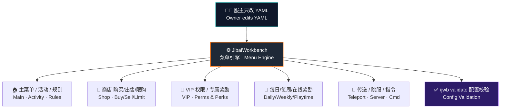

<div align="center">


### 即白服务器交互工作台 · Server Interaction Workbench

<p><strong>把 Minecraft 服务器的菜单、商店、VIP、奖励、传送和活动入口，全部变成可配置的 YAML 工作流。</strong></p>
<p><em>Turn every server entry — menus, shops, VIP, rewards, teleports & events — into configurable YAML workflows. No Java required.</em></p>

<br>


<br><br>

<a href="http://www.jibai.shop/"><strong>🌐 在线 Wiki</strong></a> ·
<a href="#-快速开始--quick-start"><strong>⚡ 快速开始</strong></a> ·
<a href="#-功能矩阵--feature-matrix"><strong>🧩 功能矩阵</strong></a> ·
<a href="#-配置示例--configuration"><strong>⚙️ 配置示例</strong></a> ·
<a href="#-指令中枢--commands"><strong>⌨️ 指令</strong></a> ·
<a href="WIKI.md"><strong>📖 完整 WIKI</strong></a>

<br>

<sub>🌐 <a href="#top">简体中文</a> · <a href="#-english">English</a></sub>

</div>

---

> [!IMPORTANT]
> **面向服主设计 · Built for server owners.** 全程只改 YAML、执行指令，**不需要写一行 Java 代码**。菜单文件位于 `plugins/JibaiWorkbench/menus/`，一个菜单一个 `.yml`，改完执行 `/jwb reload` 即可热重载生效。
> <br><em>Everything is YAML + commands. Menus live in `plugins/JibaiWorkbench/menus/`, one `.yml` per menu. Edit, then `/jwb reload`.</em>

<br>

## 🎯 项目定位 · Overview

JibaiWorkbench 是一套基于**箱子 GUI** 的服务器交互系统。它把服主常用的入口做成**可组合模块**——主菜单、商店、VIP、奖励、新手指南、传送、规则、活动页，都能通过模板一键生成，再用 YAML 修改按钮、动作、条件与展示文本。

> A chest-GUI interaction framework. Compose your server's entry points from reusable modules — spin one up from a template, then shape buttons, actions, conditions and text through YAML.



<br>

## ⚡ 快速开始 · Quick Start

> [!TIP]
> 首次启动会**自动生成 8 套默认菜单**。先跑起来，再慢慢改样式和按钮，比从零写配置快得多。
> <br><em>First launch auto-generates 8 ready-to-use menus. Run first, tweak later.</em>

| # | 操作 · Action | 结果 · Result |
|:---:|---|---|
| **01** | 把 `JibaiWorkbench-1.0.0.jar` 放进 `plugins/` | 插件准备加载 · Ready to load |
| **02** | 重启服务器 · Restart the server | 生成默认配置与菜单模板 · Configs generated |
| **03** | 游戏内执行 `/jwb open main` | 打开主菜单 · Main menu opens |
| **04** | 编辑 `menus/main.yml` | 修改标题、按钮、动作 · Edit title / buttons |
| **05** | 执行 `/jwb reload` | 热重载菜单 · Hot reload |
| **06** | 执行 `/jwb validate` | 校验 YAML / slot / Material / 依赖 · Validate |

```yaml
# menus/main.yml — 改个标题试试 · try changing a title
title: "&b&l我的服务器 &8» &f主菜单"
```

> [!WARNING]
> 所有 YAML **必须以 UTF-8 保存**，否则中文乱码。推荐 VS Code / Notepad++，**不要**用 Windows 记事本另存为 ANSI。
> <br><em>Save every YAML as **UTF-8**, or CJK text breaks.</em>

<br>

## 🧩 功能矩阵 · Feature Matrix

| 模块 · Module | 已内置能力 · Capabilities | 适合场景 · Use Cases |
|---|---|---|
| 🖼️ **GUI 菜单** | 标题、行数、背景、按钮、发光、CustomModelData、多槽位按钮 | 主菜单、规则页、活动入口 |
| ⚡ **动作系统** | `open` `close` `back`、指令、消息、标题、音效、传送、跳服、冷却 | 一次点击触发一串操作 |
| 🛒 **商店系统** | 购买、出售、限购、库存、冷却、确认页、**失败自动退款** | 金币商店、礼包、VIP 商品 |
| 🎁 **奖励系统** | 每日、每周、一次性、在线时长奖励，**状态持久化** | 签到、在线奖励、VIP 礼包 |
| 🔐 **条件系统** | 权限、金币、冷却、奖励状态（显示条件 + 点击条件） | VIP 可见按钮、金币不足禁点 |
| 🔤 **变量系统** | `{player}` `{world}` `{balance}` `{group}` + PAPI `%papi%` | 动态显示玩家信息 |
| ✅ **校验系统** | rows、slot、Material、价格、目标菜单、依赖检查 | 上线前一键排错 |

<br>

## 📦 内置模板 · Built-in Templates

<table>
  <thead>
    <tr>
      <th>模板 · Template</th>
      <th>创建命令 · Create</th>
      <th>用途 · Purpose</th>
    </tr>
  </thead>
  <tbody>
    <tr><td>🏠 <code>main</code></td><td><code>/jwb create main main</code></td><td>服务器主菜单与导航入口</td></tr>
    <tr><td>🛒 <code>shop</code></td><td><code>/jwb create shop myshop</code></td><td>购买、出售、限购、库存商店</td></tr>
    <tr><td>👑 <code>vip</code></td><td><code>/jwb create vip vip</code></td><td>按权限显示的 VIP 菜单</td></tr>
    <tr><td>🎁 <code>reward</code></td><td><code>/jwb create reward reward</code></td><td>每日、每周、在线时长奖励</td></tr>
    <tr><td>🎪 <code>activity</code></td><td><code>/jwb create activity activity</code></td><td>活动入口、限时玩法入口</td></tr>
    <tr><td>📖 <code>guide</code></td><td><code>/jwb create guide guide</code></td><td>新手指南</td></tr>
    <tr><td>🚀 <code>teleport</code></td><td><code>/jwb create teleport teleport</code></td><td>世界、主城、资源区传送</td></tr>
    <tr><td>📜 <code>rules</code></td><td><code>/jwb create rules rules</code></td><td>服务器规则展示</td></tr>
  </tbody>
</table>

<br>

## ⚙️ 配置示例 · Configuration

<details open>
<summary><strong>🛒 商店按钮 — 购买 / 出售 / 限购 / 库存全交给插件</strong></summary>

<br>

商品按钮的关键是 `shop:` 段落。插件会**自动处理扣款、发货、限购、库存**。不要再手写 `take-money`，否则容易出现「扣款成功但发货失败」的问题。

> The `shop:` block handles payment, delivery, limits and stock for you. Never hand-write `take-money`.

```yaml
buttons:
  diamond:
    slot: 10
    material: DIAMOND
    name: "&b钻石 x8"
    lore:
      - "&7购买价：&a100 金币"
      - "&7出售价：&e60 金币"
      - ""
      - "&e左键购买 &7/ &e右键出售"
    shop:
      buy-price: 100.0      # 购买价 · buy price
      sell-price: 60.0      # 出售价 · sell price
      give-item: "DIAMOND:8"
      daily-limit: 10       # 每日限购 · daily limit
      cooldown-sec: 0
      stock: -1             # -1 = 无限库存 · unlimited
      confirm: false        # true = 弹出确认页
```

</details>

<details>
<summary><strong>👑 VIP 菜单 — 按权限显示不同按钮</strong></summary>

<br>

```yaml
buttons:
  vip_only:
    slot: 15
    material: NETHER_STAR
    name: "&d&lVIP 专属指令"
    view-condition:
      - "permission: jibaiworkbench.reward.vip"
    actions:
      - "player-command: kit vip"

  status:
    slot: 4
    material: PLAYER_HEAD
    name: "&f%player_name% 的会员状态"
    lore:
      - "&7当前权限组：&b{group}"
      - "&7金币：&e{balance}"
```

</details>

<details>
<summary><strong>🎁 奖励页面 — 每日 / 每周 / 一次性 / 在线时长</strong></summary>

<br>

奖励按钮的关键是 `reward:` 段落。插件会**自动记录领取状态与冷却**，你不需要自己写"标记已领取"动作。

```yaml
buttons:
  daily:
    slot: 10
    material: CHEST
    name: "&a每日奖励"
    lore:
      - "&7每天可领取一次"
      - "&e» 点击领取"
    reward:
      key: "daily"
      type: "daily"
      give-item: "DIAMOND:2"
      commands:
        - "give {player} bread 8"

  playtime:
    slot: 16
    material: CLOCK
    name: "&e在线满 60 分钟奖励"
    reward:
      key: "playtime_60"
      type: "playtime"
      playtime-min: 60
      give-item: "GOLD_INGOT:5"
```

| type | 含义 · Meaning | 可再次领取 · Reclaim |
|---|---|---|
| `daily` | 每日奖励 | 次日 0 点后 |
| `weekly` | 每周奖励 | 下周一 0 点后 |
| `once` | 一次性 | 永不 · Never |
| `playtime` | 在线时长 | 达到 `playtime-min` 后领一次 |

</details>

<details>
<summary><strong>⚡ 按钮动作 — 按点击方式触发不同逻辑</strong></summary>

<br>

```yaml
buttons:
  hub:
    slot: 22
    material: COMPASS
    name: "&b服务器导航"
    actions:                       # 左键 · left click
      - "sound: UI_BUTTON_CLICK"
      - "message: &a正在打开导航菜单"
      - "open: teleport"
    right-actions:                 # 右键 · right click
      - "player-command: spawn"
    shift-right-actions:           # Shift+右键
      - "close:"
```

| 动作 · Action | 格式 · Format | 说明 |
|---|---|---|
| 打开菜单 | `open: <菜单ID>` | 跳到另一个菜单 |
| 返回菜单 | `back:` | 返回上一个菜单 |
| 玩家指令 | `player-command: <指令>` | 以玩家身份执行，不带 `/` |
| 控制台指令 | `console-command: <指令>` | 控制台执行，受安全开关控制 |
| 音效 | `sound: <音效>[:音量:音调]` | 播放 Bukkit 音效 |
| 传送 | `teleport: <世界>,<x>,<y>,<z>[,yaw,pitch]` | 传送到坐标 |
| 跳服 | `server: <子服名>` | 需 BungeeCord / Velocity |

</details>

<details>
<summary><strong>🔐 显示条件与点击条件 — 让按钮有"权限感"</strong></summary>

<br>

```yaml
buttons:
  vip_reward:
    slot: 13
    material: EMERALD
    name: "&aVIP 每日礼包"
    view-condition:                        # 满足才显示 · show if
      - "permission: jibaiworkbench.reward.vip"
    click-condition:                       # 满足才可点 · click if
      - "reward-unclaimed: vip_daily"
    reward:
      key: "vip_daily"
      type: "daily"
      commands:
        - "give {player} emerald 3"
```

| 条件 · Condition | 格式 · Format | 说明 |
|---|---|---|
| 有权限 | `permission: <节点>` | 拥有权限才满足 |
| 无权限 | `not-permission: <节点>` | 不拥有权限才满足 |
| 金币 | `money: <数量>` | 金币不少于指定数量 |
| 冷却结束 | `cooldown: <键>` | 指定冷却已结束 |
| 奖励未领 | `reward-unclaimed: <键>` | 奖励尚未领取 |

</details>

<br>

## ⌨️ 指令中枢 · Commands

主指令 · Main command：<kbd>/jworkbench</kbd> &nbsp;|&nbsp; 别名 · Alias：<kbd>/jwb</kbd>

| 指令 · Command | 作用 · Description | 权限 · Permission |
|---|---|---|
| `/jwb help` | 查看帮助 | `jibaiworkbench.use` |
| `/jwb open <菜单> [玩家]` | 打开菜单，可为其他玩家打开 | `jibaiworkbench.open` / `.open.others` |
| `/jwb list` | 列出所有菜单 | `jibaiworkbench.use` |
| `/jwb create <模板> <菜单ID>` | 从模板创建菜单 | `jibaiworkbench.create` |
| `/jwb copy <源> <目标>` | 复制菜单 | `jibaiworkbench.copy` |
| `/jwb reload` | 重载配置与菜单 | `jibaiworkbench.reload` |
| `/jwb validate` | 校验所有菜单配置 | `jibaiworkbench.validate` |
| `/jwb preview <菜单>` | 预览菜单 | `jibaiworkbench.preview` |
| `/jwb debug <菜单>` | 查看菜单调试信息 | `jibaiworkbench.debug` |
| `/jwb giveitem <玩家> <菜单>` | 发放右键打开菜单的快捷物品 | `jibaiworkbench.giveitem` |

<br>

## 🔌 可选依赖 · Optional Dependencies

> [!NOTE]
> 本体**零强制依赖**，单独放进 `plugins/` 就能运行。下面都是可选软依赖，装了才启用对应功能，不装也**不会**导致加载失败。
> <br><em>Zero hard dependencies. All below are soft-depends — missing ones degrade gracefully.</em>

| 依赖 · Dependency | 用途 · Enables | 缺失时表现 · Fallback |
|---|---|---|
| 💰 **Vault** + 经济插件 | 商店购买/出售、金币动作 | 按钮提示"经济功能不可用" |
| 🔤 **PlaceholderAPI** | 解析 `%papi%` 变量 | 变量保持原文本 |
| 👥 **LuckPerms** | 精确显示玩家权限组 | `{group}` 回退为 `default` |
| 🌐 **BungeeCord / Velocity** | `server:` 跳服动作 | 跳服动作不可用 |

<br>

## 🧰 排错面板 · Troubleshooting

| 现象 · Symptom | 先检查 · Check first |
|---|---|
| 改了菜单不生效 | 是否执行 `/jwb reload` |
| 中文乱码 | YAML 是否以 UTF-8 保存 |
| 商店提示经济不可用 | 是否安装 Vault + 经济插件 |
| `%xxx%` 不解析 | 是否安装 PlaceholderAPI 与对应扩展 |
| Material 报错 | 材质名是否符合当前 MC 版本 |
| slot 不对 | slot 从 **0** 开始，6 行菜单最大 **53** |
| 单个菜单加载失败 | 执行 `/jwb validate` 看具体错误 |

<br>

## 🔑 权限节点 · Permission Nodes

<details>
<summary><strong>展开全部权限节点 · Show all nodes</strong></summary>

<br>

```text
jibaiworkbench.use                 # 基础使用
jibaiworkbench.open                # 打开菜单
jibaiworkbench.open.<菜单ID>        # 打开指定菜单
jibaiworkbench.open.*              # 打开任意菜单
jibaiworkbench.open.others         # 为他人打开菜单
jibaiworkbench.admin               # 管理员总权限
jibaiworkbench.reload              # 重载
jibaiworkbench.validate            # 校验
jibaiworkbench.create              # 创建菜单
jibaiworkbench.copy                # 复制菜单
jibaiworkbench.preview             # 预览
jibaiworkbench.debug               # 调试
jibaiworkbench.giveitem            # 发放快捷物品
jibaiworkbench.shop.use            # 使用商店
jibaiworkbench.shop.buy            # 购买
jibaiworkbench.shop.sell           # 出售
jibaiworkbench.reward.claim        # 领取奖励
jibaiworkbench.reward.vip          # VIP 奖励
```

</details>

<br>

## 🛠️ 构建项目 · Build

```bash
# Linux / macOS
./gradlew build

# Windows
gradlew.bat build
```

构建产物 · Output：

```text
build/libs/JibaiWorkbench-1.0.0.jar
```

<br>

## 🗂️ 仓库结构 · Project Structure

```text
JibaiWorkbench
├─ src/main/java/me/jibai/workbench
│  ├─ action/       # 按钮动作执行 · Button actions
│  ├─ command/      # /jwb 指令 · Commands
│  ├─ condition/    # 显示/点击条件 · Conditions
│  ├─ hook/         # Vault / PAPI / LuckPerms 软依赖
│  ├─ listener/     # 菜单与玩家事件 · Listeners
│  ├─ menu/         # 菜单加载、会话、按钮模型
│  ├─ reward/       # 奖励领取逻辑 · Rewards
│  ├─ shop/         # 商店购买/出售逻辑 · Shop
│  ├─ storage/      # YAML 存储 · Storage
│  └─ template/     # 模板生成 · Templates
├─ src/main/resources/templates
│  ├─ main.yml  shop.yml  vip.yml  reward.yml  ...
├─ WIKI.md
├─ 测试报告.md
└─ 修复总结.md
```

<br>

## 📚 文档入口 · Documentation

| 文档 · Doc | 内容 · Content |
|---|---|
| 🌐 [在线 Wiki](http://www.jibai.shop/) | 网页版文档中心，支持手机端浏览 · Web docs portal |
| 📖 [WIKI.md](WIKI.md) | 完整实操教程：主菜单、商店、VIP、奖励、动作、条件、依赖、排错、字段速查 |
| 🧪 [测试报告.md](测试报告.md) | 测试过程与结果 · Test report |
| 🔧 [修复总结.md](修复总结.md) | 开发修复记录 · Fix log |

<br>

## ✅ 兼容性 · Compatibility

| 项目 · Item | 说明 · Detail |
|---|---|
| **Minecraft** | 1.20+ |
| **Java** | 17+ |
| **推荐核心** · Recommended | Paper |
| **兼容核心** · Compatible | Spigot / Bukkit / Purpur |
| **编译 API** · Compiled against | Spigot API |
| **实测环境** · Tested on | Paper 1.21.8 |

> [!CAUTION]
> 生产服上线前，请在你的**实际服务端核心、MC 版本、经济/权限插件与 PAPI 扩展**环境中，再跑一遍 `/jwb validate` 与关键菜单流程。
> <br><em>Before going live, re-run `/jwb validate` and your key menu flows on your actual core / version / plugins.</em>

<br>

---

<a name="-english"></a>

## 🌐 English

**JibaiWorkbench** turns a Minecraft server's interaction layer — menus, shops, VIP pages, rewards, teleports and event hubs — into **configurable YAML workflows**. Server owners never touch Java: generate a menu from one of **8 built-in templates**, then shape buttons, actions, conditions and text in YAML, and hot-reload with `/jwb reload`.

**Highlights**

- 🖼️ **Chest-GUI menu engine** — titles, rows, backgrounds, glow, CustomModelData, multi-slot buttons.
- 🛒 **Full shop system** — buy / sell / daily limits / stock / cooldown / confirm pages, with **automatic refund on delivery failure**.
- 🎁 **Reward system** — daily / weekly / one-time / playtime rewards with **persisted claim state**.
- 🔐 **Condition system** — gate visibility & clicks by permission, balance, cooldown or reward state.
- 🔤 **Variables** — built-in `{player}` `{world}` `{balance}` `{group}` plus PlaceholderAPI `%papi%`.
- ✅ **Config validation** — `/jwb validate` checks rows, slots, materials, prices, targets and dependencies before you go live.
- 🪶 **Zero hard dependencies** — Vault, PlaceholderAPI, LuckPerms and proxy support are all optional soft-depends that degrade gracefully.

**Quick start:** drop `JibaiWorkbench-1.0.0.jar` into `plugins/` → restart → `/jwb open main` → edit `menus/main.yml` → `/jwb reload` → `/jwb validate`. See [WIKI.md](WIKI.md) for the full guide.

<br>

---

<div align="center">

### 即白 · JibaiWorkbench

**让服务器交互菜单，从「写代码」变成「搭工作台」。**

<em>From writing code to building a workbench.</em>

<br>

<a href="http://www.jibai.shop/"></a>
<a href="WIKI.md"></a>
<a href="mailto:jibai0517@gamil.com"></a>

<br>

<sub>Made with ☕ &amp; ✨ by <strong>即白 (JIBAI)</strong> · 夜将尽，天正亮。</sub>

</div>
