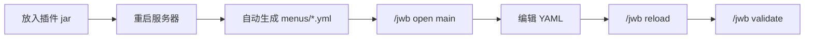

# JibaiWorkbench 即白服务器交互工作台

<p align="center">
  <strong>面向 Minecraft 服主的 GUI 菜单 / 商店 / VIP / 奖励工作台</strong>
</p>

<p align="center">
  <a href="https://github.com/A2225211273/-JibaiWorkbench">
    
  </a>
  
  
  
</p>

> [!TIP]
> 不会写 Java 也能用。JibaiWorkbench 的核心目标是：服主只需要改 YAML、套模板、执行指令，就能在 5 分钟内搭好服务器主菜单、商店、活动入口、VIP 菜单和奖励页面。

---

## 这是什么

JibaiWorkbench 是一个基于箱子 GUI 的服务器交互系统。它内置 8 套常用菜单模板，并提供商店、奖励、权限显示、变量替换、配置校验、快捷物品等能力。

你可以用它快速做出：

| 场景 | 能做什么 |
|---|---|
| 主菜单 | 服务器导航、规则入口、活动入口、传送入口 |
| 商店 | 金币购买、右键出售、限购、库存、购买确认、失败退款 |
| VIP | 按权限显示专属按钮，展示玩家权限组与余额 |
| 奖励 | 每日、每周、一次性、在线时长奖励 |
| 管理 | 复制菜单、预览菜单、校验配置、重载菜单 |

---

## 快速开始

```text
1. 将 JibaiWorkbench-1.0.0.jar 放入服务器 plugins/ 目录
2. 重启服务器，插件会自动生成默认配置和 8 套菜单模板
3. 游戏内执行 /jwb open main 打开主菜单
4. 编辑 plugins/JibaiWorkbench/menus/main.yml
5. 执行 /jwb reload 重新加载
6. 执行 /jwb validate 检查配置是否写错
```



> [!IMPORTANT]
> 所有 YAML 文件请使用 UTF-8 编码保存。推荐 VS Code / Notepad++，不要用 Windows 记事本另存为 ANSI，否则中文可能乱码。

---

## 内置模板

| 模板 ID | 用途 | 创建命令 |
|---|---|---|
| `main` | 主菜单 | `/jwb create main main` |
| `shop` | 商店 | `/jwb create shop myshop` |
| `activity` | 活动入口 | `/jwb create activity activity` |
| `vip` | VIP 菜单 | `/jwb create vip vip` |
| `reward` | 奖励页面 | `/jwb create reward reward` |
| `guide` | 新手指南 | `/jwb create guide guide` |
| `teleport` | 传送菜单 | `/jwb create teleport teleport` |
| `rules` | 规则页面 | `/jwb create rules rules` |

---

## 核心功能

- **GUI 菜单系统**：标题、行数、打开权限、背景填充、多槽位按钮、发光、CustomModelData、动态变量文本。
- **按钮动作**：打开菜单、返回、关闭、玩家指令、控制台指令、聊天消息、标题、ActionBar、音效、扣钱、给钱、给物品、传送、跳服、冷却。
- **商店系统**：购买、出售、权限商品、一次性购买、每日限购、购买冷却、库存、确认页、失败自动退款。
- **奖励系统**：每日、每周、一次性、在线时长奖励，领取记录持久化到 `data/players.yml`。
- **条件系统**：支持显示条件 `view-condition` 与点击条件 `click-condition`，可按权限、金币、世界、冷却、奖励状态控制按钮。
- **变量系统**：内置 `{player}`、`{world}`、`{online}`、`{balance}`、`{group}`、`{date}`、`{time}`，安装 PlaceholderAPI 后支持 `%papi%` 变量。
- **配置校验**：`/jwb validate` 检查 rows、slot、Material、价格、目标菜单、依赖状态等问题，并输出修复建议。

---

## 指令速查

主指令：`/jworkbench`  
别名：`/jwb`

| 指令 | 说明 | 权限 |
|---|---|---|
| `/jwb help` | 查看帮助 | `jibaiworkbench.use` |
| `/jwb open <菜单> [玩家]` | 打开菜单，可为他人打开 | `jibaiworkbench.open` / `.open.others` |
| `/jwb list` | 列出所有菜单 | `jibaiworkbench.use` |
| `/jwb create <模板> <菜单ID>` | 从模板创建菜单 | `jibaiworkbench.create` |
| `/jwb copy <源> <目标>` | 复制菜单 | `jibaiworkbench.copy` |
| `/jwb reload` | 重载配置与菜单 | `jibaiworkbench.reload` |
| `/jwb validate` | 校验所有菜单配置 | `jibaiworkbench.validate` |
| `/jwb preview <菜单>` | 预览菜单 | `jibaiworkbench.preview` |
| `/jwb debug <菜单>` | 查看菜单调试信息 | `jibaiworkbench.debug` |
| `/jwb giveitem <玩家> <菜单>` | 发放右键打开菜单的快捷物品 | `jibaiworkbench.giveitem` |

---

## 可选依赖

全部依赖都是软依赖：没有安装也不会导致插件崩溃，只是对应功能不可用或降级。

| 依赖 | 作用 | 没安装会怎样 |
|---|---|---|
| Vault + 经济插件 | 商店购买/出售、扣钱/给钱动作 | 提示经济功能不可用 |
| PlaceholderAPI | 解析 `%xxx%` 变量 | 变量保持原文本 |
| LuckPerms | 精确显示玩家权限组 | `{group}` 回退为 `default` |
| BungeeCord / Velocity | 跳服动作 `server:` | 跳服动作不可用 |

> [!NOTE]
> 如果你只想做普通菜单、规则页、传送页、新手指南，不安装这些依赖也可以正常使用。

---

## YAML 示例

<details open>
<summary><strong>创建一个商店按钮</strong></summary>

```yaml
buttons:
  diamond:
    slot: 10
    material: DIAMOND
    name: "&b钻石 x8"
    lore:
      - "&7购买价：&a100 金币"
      - "&7出售价：&e60 金币"
      - ""
      - "&e左键购买 &7/ &e右键出售"
    shop:
      buy-price: 100.0
      sell-price: 60.0
      give-item: "DIAMOND:8"
      daily-limit: 10
      cooldown-sec: 0
      stock: -1
      confirm: false
```

</details>

<details>
<summary><strong>创建一个 VIP 专属按钮</strong></summary>

```yaml
buttons:
  vip_only:
    slot: 15
    material: NETHER_STAR
    name: "&d&lVIP 专属指令"
    view-condition:
      - "permission: jibaiworkbench.reward.vip"
    actions:
      - "player-command: kit vip"
```

</details>

<details>
<summary><strong>创建一个每日奖励</strong></summary>

```yaml
buttons:
  daily:
    slot: 10
    material: CHEST
    name: "&a每日奖励"
    lore:
      - "&7每天可领取一次"
      - "&e» 点击领取"
    reward:
      key: "daily"
      type: "daily"
      give-item: "DIAMOND:2"
      commands:
        - "give {player} bread 8"
```

</details>

---

## 权限节点

| 类型 | 权限 |
|---|---|
| 基础 | `jibaiworkbench.use`、`jibaiworkbench.open`、`jibaiworkbench.open.<菜单ID>`、`jibaiworkbench.open.*` |
| 管理 | `jibaiworkbench.admin`、`.reload`、`.validate`、`.create`、`.copy`、`.preview`、`.debug`、`.giveitem`、`.open.others` |
| 商店 | `jibaiworkbench.shop.use`、`.shop.buy`、`.shop.sell` |
| 奖励 | `jibaiworkbench.reward.claim`、`.reward.vip` |

---

## 常见问题

<details>
<summary><strong>商店点击后没反应？</strong></summary>

商店功能需要 Vault + 一个经济插件，例如 EssentialsX。没装时插件不会崩溃，但会提示经济功能不可用。

</details>

<details>
<summary><strong>变量 %xxx% 没解析？</strong></summary>

需要安装 PlaceholderAPI 以及对应扩展。未安装时，PlaceholderAPI 变量会保持原文本。

</details>

<details>
<summary><strong>修改菜单后不生效？</strong></summary>

执行 `/jwb reload`。如果仍然不生效，执行 `/jwb validate` 查看 YAML、slot、Material、目标菜单等是否写错。

</details>

<details>
<summary><strong>菜单配置写错会不会导致整个插件崩溃？</strong></summary>

不会。单个菜单写错会被跳过，其余菜单照常加载。你可以用 `/jwb validate` 查看具体错误和修复建议。

</details>

---

## 项目结构

```text
JibaiWorkbench
├─ src/main/java/me/jibai/workbench
│  ├─ action/       # 按钮动作执行
│  ├─ command/      # /jwb 指令
│  ├─ condition/    # 显示/点击条件
│  ├─ hook/         # Vault / PAPI / LuckPerms 软依赖
│  ├─ listener/     # 菜单与玩家事件
│  ├─ menu/         # 菜单加载、会话、按钮模型
│  ├─ reward/       # 奖励领取逻辑
│  ├─ shop/         # 商店购买/出售逻辑
│  ├─ storage/      # YAML 存储
│  └─ template/     # 模板生成
├─ src/main/resources
│  ├─ templates/    # 8 套默认菜单模板
│  ├─ config.yml
│  ├─ messages.yml
│  └─ plugin.yml
├─ WIKI.md          # 详细使用教程
└─ build.gradle.kts
```

---

## 构建

```bash
./gradlew build
```

Windows：

```bat
gradlew.bat build
```

构建完成后，插件 jar 会生成在：

```text
build/libs/JibaiWorkbench-1.0.0.jar
```

---

## 详细文档

完整实操教程请看：

- [WIKI.md](WIKI.md)：5 分钟主菜单、商店、VIP、奖励、按钮动作、条件、依赖接入、排错和字段速查。
- [测试报告.md](测试报告.md)：本地测试记录。
- [修复总结.md](修复总结.md)：开发与修复记录。

---

## 兼容性

| 项目 | 说明 |
|---|---|
| Minecraft | 1.20+ |
| Java | 17+ |
| 推荐核心 | Paper |
| 兼容核心 | Spigot / Bukkit / Purpur |
| 编译 API | Spigot API，避免 Paper 专属 API |
| 实测环境 | Paper 1.21.8 |

> [!WARNING]
> 生产服上线前，建议先在你的目标服务端核心和版本上自测一遍，尤其是经济、权限组、PlaceholderAPI 扩展和跳服相关功能。

---

## 作者

**即白**

- Email：jibai0517@gamil.com
- 项目：JibaiWorkbench 即白服务器交互工作台

